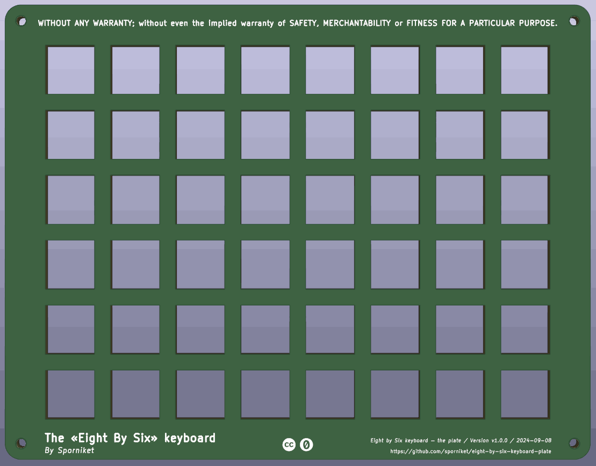

# 8 columns × 6 rows keyboard hardware

> [WARNING] Please read carefully this note before using this project. It contains important facts.

Content

1. What is **8 columns × 6 rows keyboard hardware**, and when to use it ?
2. What should you know before using **8 columns × 6 rows keyboard hardware** ?
3. How to use **8 columns × 6 rows keyboard hardware** ?
4. Known issues
5. Miscellanous

## 1. What is **8 columns × 6 rows keyboard hardware**, and when to use it ?

**8 columns × 6 rows keyboard hardware** is a hardware project of an ortholinear, 8 columns by 6 rows, DIY keyboard. This keyboard has 2 connectors port to plug a driver board that will be driven by the micro-controller of your choice (Raspberry Pi Pico, Espressif ESP32, ATmega, ...) and will be responsible for scanning keys, displaying status and communicate with the host computer.

### Licence

**8 columns × 6 rows keyboard hardware** is published under the Creative Commons CC0 license. You can find a copy of the licence there : https://creativecommons.org/publicdomain/zero/1.0/legalcode

You can copy, modify, distribute and perform the work, even for commercial purposes, all without asking permission.

**8 columns × 6 rows keyboard hardware** is distributed in the hope that it will be useful, but WITHOUT ANY WARRANTY; without even the implied warranty of MERCHANTABILITY or FITNESS FOR A PARTICULAR PURPOSE.

### Release notes

#### V1.0.0

* Initial release

## 2. What should you know before using **8 columns × 6 rows keyboard hardware** ?

* **8 columns × 6 rows keyboard hardware** is made using Kicad 8.
* This project use the footprint library of key switches from : https://github.com/siderakb/key-switches.pretty

> Do not use **8 columns × 6 rows keyboard hardware** if this project is not suitable for your project.

## 3. How to use **8 columns × 6 rows keyboard hardware** ?

### From sources

To get the latest available work, one must clone the git repository, build and install the package.

	git clone --recurse-submodules https://github.com/sporniket/eight-by-six-keyboard-hardware.git

Then, open the project with Kicad 8.

## 4. Known issues
See the [project issues](https://github.com/sporniket/eight-by-six-keyboard-hardware/issues) page.

## 5. Miscellanous

### Report issues
Use the [project issues](https://github.com/sporniket/eight-by-six-keyboard-hardware/issues) page.
